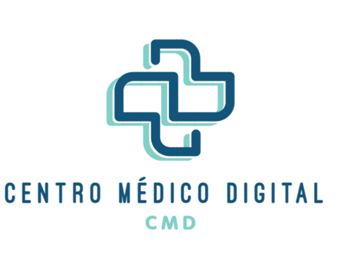

# CMD - CENTRO MÉDICO DIGITAL


Um sistema que vai ser maneiro pros postos de saúde


## Dependências e Versões Necessárias
* [Xampp](https://www.apachefriends.org/pt_br/download.html) 
* [PHP](https://www.php.net/docs.php) - Linguagem de programação 
* [MYSQL](https://dev.mysql.com/doc/) - Banco de dados
* [Laravel](https://laravel.com/) - Framework


## Como rodar o projeto ✅
Rodar o mysql e o apache

Uma boa forma de descrever o passo a passo é:

```
git clone https://github.com/alexfigueirinha/cmd.git
```
```
cd cmd
```
```
composer update
```
```
php artisan migrate
```
```
php artisan db:seed
```
```
php artisan serve
```

Deixe claro como a pessoa pode confirmar que a aplicação está rodando da forma correta. Pode ser com prints ou a mensagem que ela deve esperar.


## ✒️ Autores

* **Gabriel Lima** - [Lima](https://github.com/gp0987gp)
* **Lucas Ronaldo** - [Lucas](https://github.com/LucasRonaldo)
* **Ana Luiza** - [Ana](https://github.com/Analuuuiza)
* **Renan** - [Renan](https://github.com/renanbno)
* **Reginaldo** - [Reginaldo](https://github.com/Regisjr246)

Você também pode ver a lista de todos os [colaboradores](https://github.com/gp0987gp) que participaram deste projeto.

## 📄 Licença

Este projeto está sob a licença **MANEIRA** - veja o arquivo [LICENSE.md](./LICENSE.md) para detalhes.

## 🎁 Expressões de gratidão

* Conte a outras pessoas sobre este projeto 📢;
* Convide alguém da equipe para um café;
