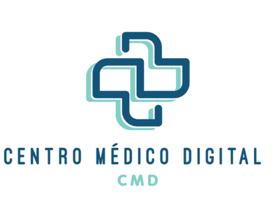

# CMD - CENTRO MÉDICO DIGITAL

O Centro Médico Digital - CMD tem como meta aprimorar a eficiência e a qualidade do atendimento em postos de saúde, ao mesmo tempo em que oferece insights essenciais para a prevenção e monitoramento de doenças. Ao digitalizar processos e registros, o sistema minimiza a burocracia, permitindo que os profissionais de saúde direcionem sua atenção de forma mais eficaz ao cuidado dos pacientes.



## Dependências e Versões Necessárias
* [Xampp](https://www.apachefriends.org/pt_br/download.html)
* PHP >= 7.4
* [MYSQL](https://dev.mysql.com/doc/) - Banco de dados
* [Laravel](https://laravel.com/) - Framework

## Requisitos adicionais

* Extensões do PHP necessárias:
  * PDO
  * Mbstring
  * OpenSSL
  * Tokenizer
  * XML

Certifique-se de que essas extensões estão habilitadas no seu ambiente.

## Como rodar o projeto ✅
1. Clone este repositório para o seu ambiente de desenvolvimento local utilizando o comando:
```
git clone https://github.com/alexfigueirinha/cmd.git
```

2. Acesse o diretório do projeto:
```
cd cmd
```

3. Copie o arquivo `.env.example` para `.env`:
```
cp .env.example .env
```

4. Configure o arquivo `.env` com suas credenciais de banco de dados.
   
5. Atualize o Composer:
```
composer update
```

6. Rodando o Migrate:
```
php artisan migrate
```

7. Inicializando o Seeder:
```
php artisan db:seed
```

8. Inicializando o Servidor:
```
php artisan serve
```

Após rodar o servidor, acesse `http://localhost:8000/home` em seu navegador. Você deverá ver a página inicial da aplicação CMD.

## ✒️ Autores


<table>
  <tr>
    <td align="center">
      <a href="#">
        <br>
        <sub>
          <a href="https://github.com/gp0987gp">Gabriel Lima</a>
        </sub>
      </a>
    <td align="center">
      <a href="#">
        <br>
        <sub>
          <a href="https://github.com/Analuuuiza">Ana Luiza<a>
          <td align="center">
      <a href="#">
        <br>
        <sub>
          <a href="https://github.com/LucasRonaldo">Lucas Ronaldo</a>
          <td align="center">
      <a href="#">
        <br>
        <sub>
          <a href="https://github.com/Regisjr246">Reginaldo</a>
          <td align="center">
      <a href="#">
        <br>
        <sub>
          <a href="https://github.com/renanbno">Renan </a>

  </tr>
</table>

## 📄 Licença

Este projeto está sob a licença **MIT** - veja o arquivo [LICENSE.md](./LICENSE.md) para detalhes.

## 🎁 Expressões de gratidão

* Conte a outras pessoas sobre este projeto 📢;
* Convide alguém da equipe para um café;

## Como Contribuir

1. Fork o repositório
2. Crie uma branch para sua feature (`git checkout -b feature/nova-feature`)
3. Commit suas alterações (`git commit -am 'Adicionando nova feature'`)
4. Push para a branch (`git push origin feature/nova-feature`)
5. Abra um Pull Request
